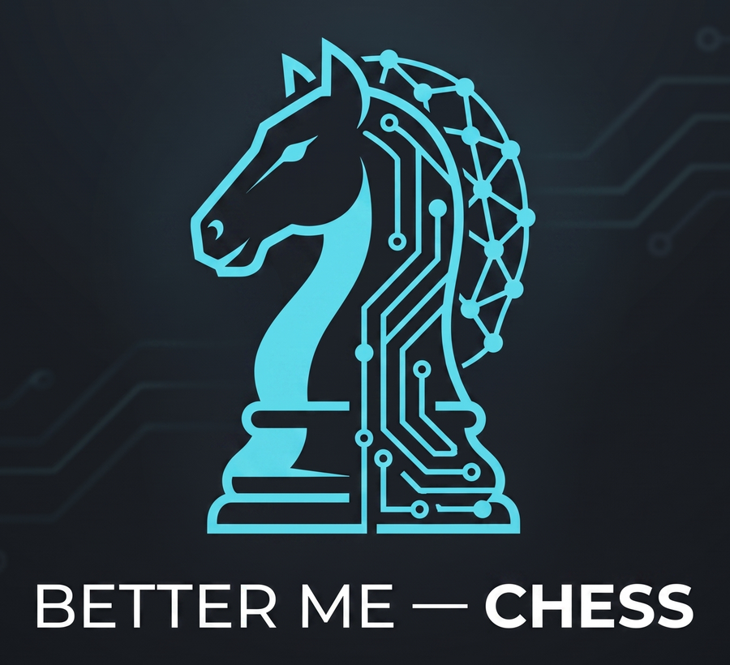
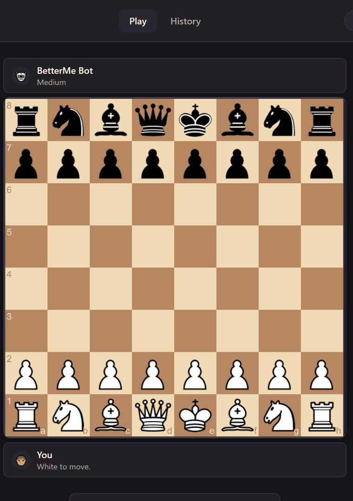
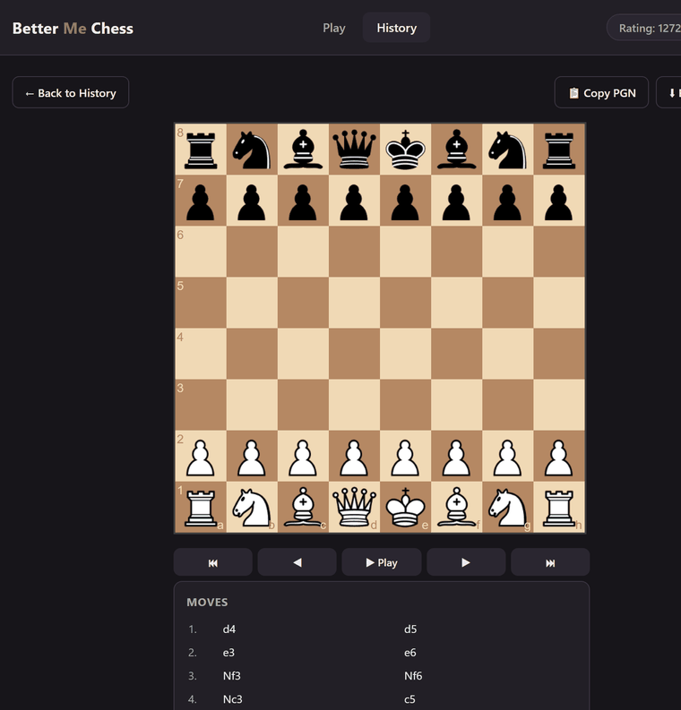
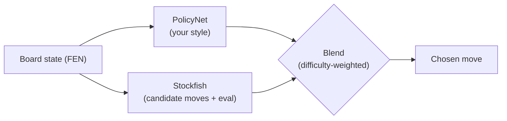

<p align="center"></p>


An engine that plays like *you* (style-biased), blended with Stockfish for
strength. Play it in a chess.com-style local web app, review your games with
Stockfish-powered blunder analysis, track a local rating, and get in-game
"Coach" hints from your own "better you". See [`plan.md`](plan.md) for the
full build log.

| Playing | Post-game review |
|---|---|
|  |  |

## How it works



1. **Style model** — a small CNN trained via behavior cloning on your own
   Chess.com games (`train_style.py` / `colab_train_style.ipynb`). Given a
   position, it scores how likely *you* are to play each legal move.
2. **Strength engine** — Stockfish generates the top-N candidate moves for
   the position with their evals. It's never trained, just installed.
3. **Blend** (`blend_engine.py`) — combines the two: your style model's
   preference vs. Stockfish's raw eval, weighted by difficulty (easy = mostly
   your style, hard = mostly the objectively best move). Always restricted to
   moves your style model finds at least somewhat plausible, even on hard —
   it never plays something you basically never would.

## Features

- Local web app (chess.com-style board, move list, legal-move highlighting,
  sound) to play against your blend engine at easy/medium/hard.
- In-game "Coach" hints — what your blend would play from the current position.
- Post-game review: Stockfish re-analyzes every move, flags blunders and
  average centipawn loss, and shows what the engine would've played instead.
- A local Elo-style rating that updates after every game against a fixed
  per-difficulty bot strength estimate — tracked in the History tab.
- PGN export (download or copy to clipboard), with full chess.com-style headers.

## Setup

```
pip install python-chess requests torch flask
```

Stockfish binary goes at `engine/stockfish.exe` (path is configurable, see
below) — gitignored, since the binary is too large for GitHub. Fetch it fresh
on a new clone:
```
curl -sL "https://github.com/official-stockfish/Stockfish/releases/download/sf_18/stockfish-windows-x86-64.zip" -o engine/stockfish.zip
unzip -j engine/stockfish.zip "*/stockfish-windows-x86-64.exe" -d engine
mv "engine/stockfish-windows-x86-64.exe" engine/stockfish.exe
rm engine/stockfish.zip
```
(On macOS/Linux, grab the matching build from the
[Stockfish releases page](https://github.com/official-stockfish/Stockfish/releases)
instead.)

A pre-trained demo checkpoint (`models/demo_policy.pt`) ships in the repo, so
you can try the app immediately with `python app.py` before training your own.

## Configuration

Everything below can be set via CLI args or a `.env` file (copy
[`.env.example`](.env.example) to `.env`) — CLI args win if both are set.

| Variable          | CLI flag       | Default                   | What it is                          |
|--------------------|----------------|----------------------------|--------------------------------------|
| `STOCKFISH_PATH`   | —              | `engine/stockfish.exe`     | Path to the Stockfish binary        |
| `PORT`             | `--port`       | `5000`                     | Port the local web app listens on   |
| `CHESS_USERNAME`   | positional arg | `demo`                     | Whose style model to load           |

## Usage

### 1. Data loop (repeat as you play more Chess.com games)
```
python fetch_games.py <your_chesscom_username>
python build_dataset.py <your_chesscom_username> data/<username>_games.pgn
```

### 2. Train your style model
Primary training happens on Colab (`colab_train_style.ipynb`, T4 GPU) —
upload `data/<username>_positions.jsonl`, run all cells, download the
resulting `<username>_policy.pt` into `models/`. `train_style.py` also works
standalone for small local smoke tests; both share the same architecture so
checkpoints are interchangeable.

Quick sanity check after downloading a checkpoint:
```
python predict.py <username> "<FEN of a position>"
```

### 3. Play
```
python app.py <username>
```
Opens the local web app at `http://127.0.0.1:<PORT>` (default 5000).

## Notes / known limitations

- 50 games ≈ thin data. A freshly trained model will be crude at first —
  plays *quirky*, not *strong*.
- Growth path: once you have 500+ games, swap `PolicyNet` for fine-tuning
  actual lc0 weights instead of training from scratch — far stronger
  baseline, same imitation idea.
- `models/<username>_policy.pt` is the checkpoint — back it up, it's the
  whole point.
- `data/history.db` holds your played-game history (PGN + result per game) —
  gitignored, stays local.
- The local rating is informal — not synced with chess.com/FIDE. Bot Elo
  values per difficulty are rough estimates of playing strength, not measured.
- Single global game state (one local player, one active game at a time) —
  this is a personal tool, not a multi-user server.
- Promotions always auto-queen; unfinished (abandoned) games aren't saved to history.

## License

MIT — see [`LICENSE`](LICENSE). Use it, fork it, train it on your own games.
